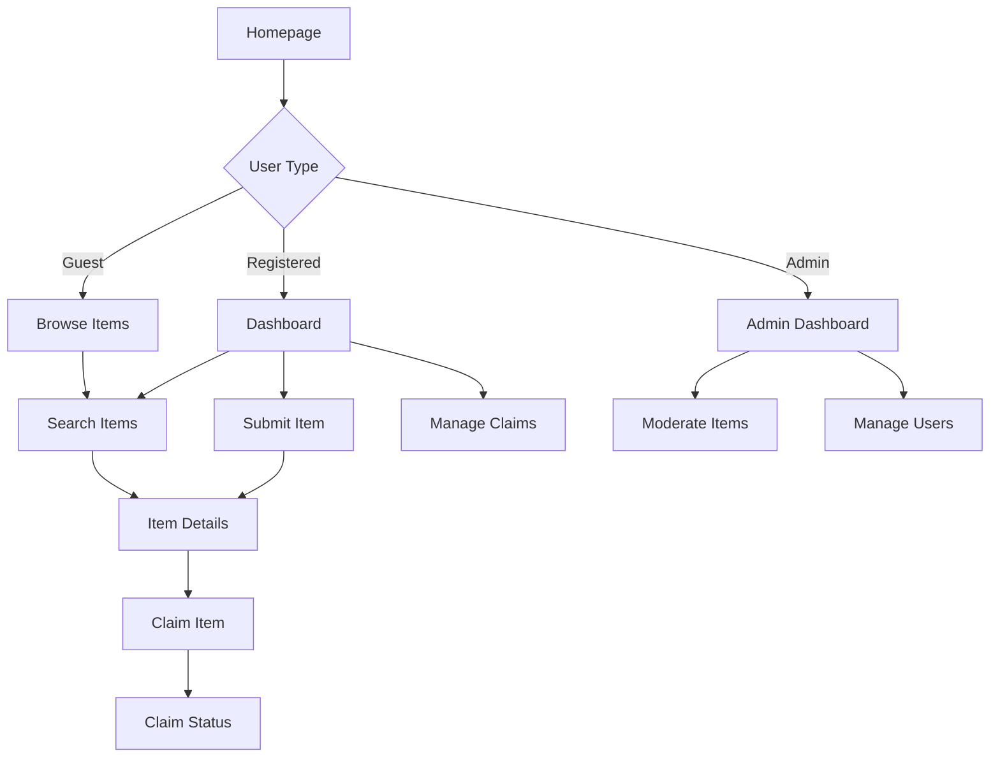

## 1. Product Overview
A comprehensive lost and found web application designed for campus use, enabling students and staff to report lost items, search for found items, and manage claims efficiently. The platform streamlines the traditional lost and found process by providing real-time updates, secure image uploads, and automated matching capabilities.

This digital solution addresses the common problem of lost items on campus by providing a centralized, accessible platform that connects finders with owners, reduces administrative burden, and improves item recovery rates.

## 2. Core Features

### 2.1 User Roles
| Role | Registration Method | Core Permissions |
|------|---------------------|------------------|
| Student/Staff | Email registration with campus verification | Can submit lost items, search items, make claims, manage own submissions |
| Admin | Manual creation by system administrator | Can moderate all items, manage claims, view analytics, manage users |
| Guest | Limited access without registration | Can browse and search items (view-only) |

### 2.2 Feature Module
Our lost and found application consists of the following main pages:
1. **Homepage**: Hero section, item search, recent items, quick navigation
2. **Item Submission**: Form for reporting lost/found items with image upload
3. **Item Details**: Detailed view of items with claim functionality
4. **Search Results**: Filterable and searchable item listings
5. **User Dashboard**: Personal item management, claim history, profile settings
6. **Admin Dashboard**: Content moderation, user management, system analytics
7. **Login/Register**: Authentication flows with campus email verification

### 2.3 Page Details
| Page Name | Module Name | Feature description |
|-----------|-------------|---------------------|
| Homepage | Hero Section | Display campus branding, quick action buttons for report/find items |
| Homepage | Search Bar | Real-time search with category and location filters |
| Homepage | Recent Items | Show latest 6 items with images and basic info |
| Item Submission | Item Form | Input fields for title, description, category, location, date found |
| Item Submission | Image Upload | Drag-and-drop image upload with preview and compression |
| Item Submission | Location Picker | Interactive campus map for precise location selection |
| Item Details | Item Information | Display all item details with high-resolution images |
| Item Details | Claim Button | Submit claim with proof of ownership details |
| Item Details | Contact Info | Secure messaging system between claimant and item holder |
| Search Results | Filter Sidebar | Category, date range, location, and status filters |
| Search Results | Item Grid | Paginated grid view with thumbnail images |
| User Dashboard | My Items | List of user's submitted items with status indicators |
| User Dashboard | My Claims | Track claim status and communication history |
| User Dashboard | Profile Settings | Update personal information and notification preferences |
| Admin Dashboard | Pending Reviews | Queue of items requiring moderation approval |
| Admin Dashboard | User Management | View and manage user accounts and permissions |
| Admin Dashboard | Analytics | Usage statistics and item recovery metrics |

## 3. Core Process
### Student/Staff Flow
1. User visits homepage and can immediately search for lost items
2. If item not found, user can submit a new lost item report with details and images
3. User receives notifications when potential matches are found
4. User can claim found items by providing proof of ownership
5. User tracks claim status through personal dashboard

### Admin Flow
1. Admin logs in to access moderation dashboard
2. Reviews newly submitted items for appropriate content
3. Approves or rejects items with reasoning
4. Manages disputes between claimants
5. Monitors system analytics and user activity

### Guest Flow
1. Browse available items without registration
2. View item details and campus contact information
3. Cannot submit items or make claims without account

## 4. User Interface Design

### 4.1 Design Style
- **Primary Colors**: Campus blue (#003366) with white backgrounds
- **Secondary Colors**: Light gray (#f5f5f5) for cards, success green (#28a745) for claimed items
- **Button Style**: Rounded corners with subtle shadows, primary actions in campus blue
- **Typography**: Clean sans-serif font (Inter), 16px base size with clear hierarchy
- **Layout**: Card-based design with consistent spacing, top navigation bar
- **Icons**: Modern line icons from Feather Icons or similar open-source set

### 4.2 Page Design Overview
| Page Name | Module Name | UI Elements |
|-----------|-------------|-------------|
| Homepage | Hero Section | Full-width banner with campus image overlay, prominent CTA buttons |
| Homepage | Search Bar | Centered search input with category dropdown, location picker |
| Homepage | Recent Items | 3-column responsive grid, hover effects on cards, status badges |
| Item Submission | Form Container | White card with shadow, multi-step form with progress indicator |
| Item Submission | Image Upload | Drag-and-drop zone with thumbnail preview, file size indicator |
| Search Results | Filter Sidebar | Collapsible accordion filters, clear all button, result count |
| User Dashboard | Navigation Tabs | Horizontal tabs for different sections, active state highlighting |
| Admin Dashboard | Data Tables | Sortable columns, action buttons, bulk operations checkbox |

### 4.3 Responsiveness
- Desktop-first design approach with mobile optimization
- Breakpoints: 768px (tablet), 1024px (desktop)
- Touch-friendly interface with larger tap targets on mobile
- Collapsible navigation menu for smaller screens
- Optimized image loading with responsive sizing