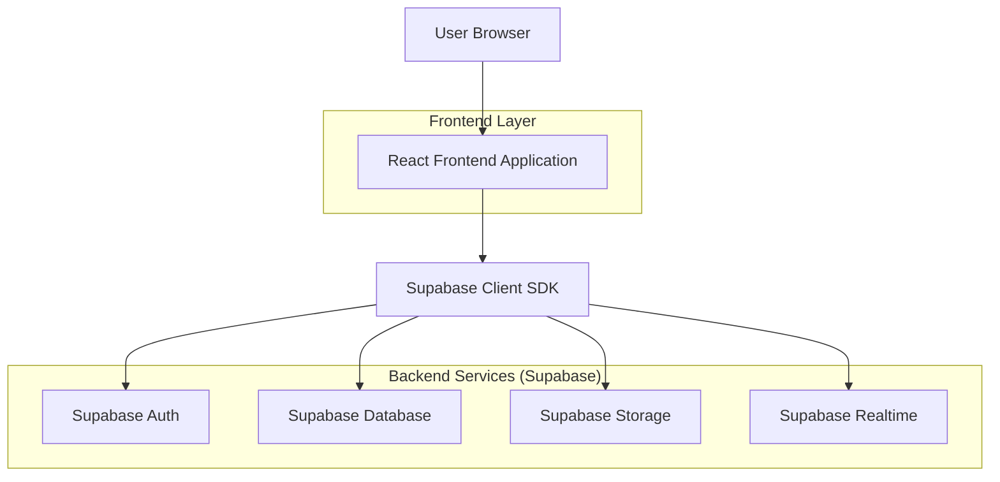
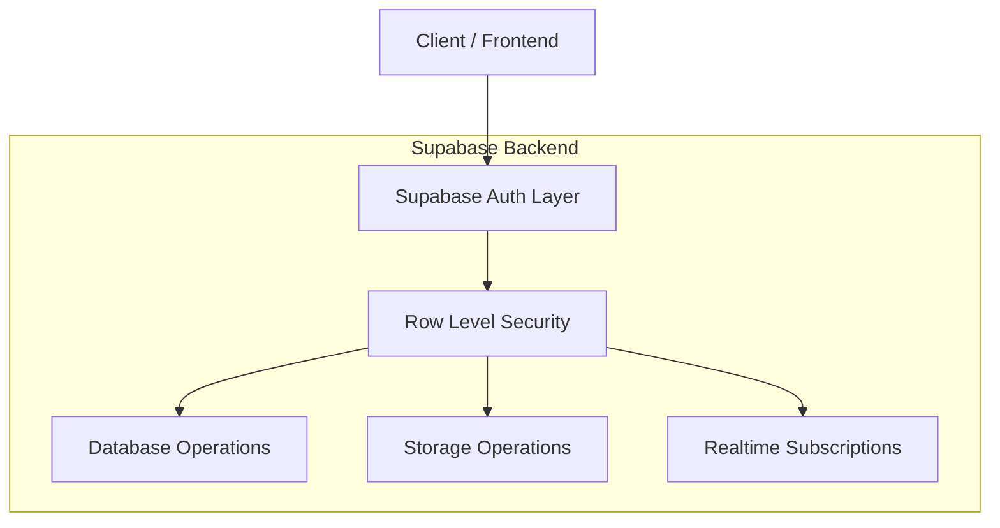
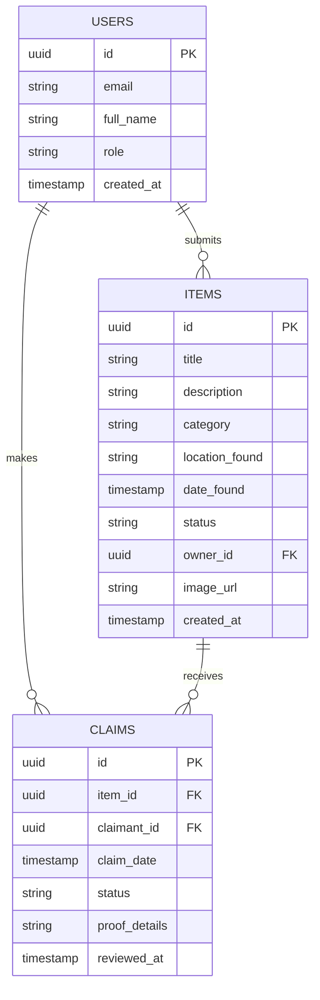

## 1. Architecture Design



## 2. Technology Description

- **Frontend**: React@18 + TailwindCSS@3 + Vite
- **Backend**: Supabase (BaaS)
- **Authentication**: Supabase Auth with email verification
- **Database**: PostgreSQL (via Supabase)
- **Storage**: Supabase Storage for images
- **Realtime**: Supabase Realtime for live updates

## 3. Route Definitions

| Route | Purpose |
|-------|---------|
| `/` | Homepage with search and recent items |
| `/auth/login` | User login page |
| `/auth/register` | User registration page |
| `/items/submit` | Submit new lost/found item form |
| `/items/:id` | Individual item details page |
| `/items/search` | Search and filter items |
| `/dashboard` | User dashboard for managing items |
| `/admin` | Admin dashboard for moderation |
| `/profile` | User profile and settings |

## 4. API Definitions

### 4.1 Authentication APIs

```
POST /auth/v1/token
```

Request:
| Param Name | Param Type | isRequired | Description |
|------------|-------------|-------------|-------------|
| email | string | true | User email address |
| password | string | true | User password |

Response:
| Param Name | Param Type | Description |
|------------|-------------|-------------|
| access_token | string | JWT access token |
| refresh_token | string | Refresh token for session |
| user | object | User profile data |

### 4.2 Item Management APIs

```
GET /rest/v1/items
```

Query Parameters:
| Param Name | Param Type | Description |
|------------|-------------|-------------|
| category | string | Filter by item category |
| status | string | Filter by item status |
| location | string | Filter by location found |
| search | string | Text search in title/description |

```
POST /rest/v1/items
```

Request Body:
| Param Name | Param Type | isRequired | Description |
|------------|-------------|-------------|-------------|
| title | string | true | Item title |
| description | string | false | Item description |
| category | string | true | Item category |
| location_found | string | true | Location where found |
| status | string | false | Item status (default: 'unclaimed') |

### 4.3 Claim Management APIs

```
POST /rest/v1/claims
```

Request Body:
| Param Name | Param Type | isRequired | Description |
|------------|-------------|-------------|-------------|
| item_id | uuid | true | ID of claimed item |
| proof_details | string | true | Proof of ownership details |

## 5. Server Architecture Diagram



## 6. Data Model

### 6.1 Database Schema



### 6.2 Data Definition Language

**Users Table (auth.users - managed by Supabase)**
```sql
-- Items table
CREATE TABLE items (
    id UUID PRIMARY KEY DEFAULT gen_random_uuid(),
    title TEXT NOT NULL,
    description TEXT,
    category TEXT NOT NULL,
    location_found TEXT NOT NULL,
    date_found TIMESTAMPTZ DEFAULT NOW(),
    status TEXT DEFAULT 'unclaimed' CHECK (status IN ('unclaimed', 'claimed', 'returned', 'expired')),
    owner_id UUID REFERENCES auth.users(id) ON DELETE CASCADE,
    image_url TEXT,
    created_at TIMESTAMPTZ DEFAULT NOW(),
    updated_at TIMESTAMPTZ DEFAULT NOW()
);

-- Claims table
CREATE TABLE claims (
    id UUID PRIMARY KEY DEFAULT gen_random_uuid(),
    item_id UUID REFERENCES items(id) ON DELETE CASCADE,
    claimant_id UUID REFERENCES auth.users(id) ON DELETE CASCADE,
    claim_date TIMESTAMPTZ DEFAULT NOW(),
    status TEXT DEFAULT 'pending' CHECK (status IN ('pending', 'approved', 'rejected')),
    proof_details TEXT NOT NULL,
    reviewed_by UUID REFERENCES auth.users(id),
    reviewed_at TIMESTAMPTZ,
    created_at TIMESTAMPTZ DEFAULT NOW()
);

-- Categories table for standardization
CREATE TABLE categories (
    id UUID PRIMARY KEY DEFAULT gen_random_uuid(),
    name TEXT UNIQUE NOT NULL,
    description TEXT,
    icon TEXT,
    created_at TIMESTAMPTZ DEFAULT NOW()
);

-- Insert default categories
INSERT INTO categories (name, description, icon) VALUES
('Electronics', 'Electronic devices and gadgets', 'smartphone'),
('Clothing', 'Clothing items and accessories', 'shirt'),
('Books', 'Books, notebooks, and study materials', 'book'),
('Keys', 'Keys and keychains', 'key'),
('Wallet', 'Wallets, purses, and financial items', 'wallet'),
('Bag', 'Bags, backpacks, and luggage', 'bag'),
('Jewelry', 'Jewelry and watches', 'diamond'),
('Documents', 'Important documents and IDs', 'file-text'),
('Sports', 'Sports equipment and gear', 'football'),
('Other', 'Miscellaneous items', 'box');

-- Create indexes for performance
CREATE INDEX idx_items_status ON items(status);
CREATE INDEX idx_items_category ON items(category);
CREATE INDEX idx_items_owner_id ON items(owner_id);
CREATE INDEX idx_items_created_at ON items(created_at DESC);
CREATE INDEX idx_claims_item_id ON claims(item_id);
CREATE INDEX idx_claims_claimant_id ON claims(claimant_id);
CREATE INDEX idx_claims_status ON claims(status);

-- Set up storage bucket
INSERT INTO storage.buckets (id, name, public, file_size_limit, allowed_mime_types) 
VALUES ('item_images', 'item_images', true, 5242880, ARRAY['image/jpeg', 'image/png', 'image/webp']);

-- Row Level Security Policies
ALTER TABLE items ENABLE ROW LEVEL SECURITY;
ALTER TABLE claims ENABLE ROW LEVEL SECURITY;
ALTER TABLE categories ENABLE ROW LEVEL SECURITY;

-- Items policies
CREATE POLICY "Anyone can view unclaimed items" ON items
    FOR SELECT USING (status = 'unclaimed');

CREATE POLICY "Authenticated users can create items" ON items
    FOR INSERT WITH CHECK (auth.uid() = owner_id);

CREATE POLICY "Users can update their own items" ON items
    FOR UPDATE USING (auth.uid() = owner_id);

CREATE POLICY "Users can delete their own items" ON items
    FOR DELETE USING (auth.uid() = owner_id);

-- Claims policies
CREATE POLICY "Anyone can view approved claims" ON claims
    FOR SELECT USING (status = 'approved');

CREATE POLICY "Authenticated users can create claims" ON claims
    FOR INSERT WITH CHECK (auth.uid() = claimant_id);

CREATE POLICY "Users can view their own claims" ON claims
    FOR SELECT USING (auth.uid() = claimant_id);

CREATE POLICY "Item owners can view claims on their items" ON claims
    FOR SELECT USING (auth.uid() IN (SELECT owner_id FROM items WHERE id = item_id));

-- Admin policies (assuming admin role)
CREATE POLICY "Admins can manage all items" ON items
    FOR ALL USING (EXISTS (SELECT 1 FROM auth.users WHERE id = auth.uid() AND role = 'admin'));

CREATE POLICY "Admins can manage all claims" ON claims
    FOR ALL USING (EXISTS (SELECT 1 FROM auth.users WHERE id = auth.uid() AND role = 'admin'));

-- Grant permissions
GRANT SELECT ON items TO anon;
GRANT ALL ON items TO authenticated;
GRANT SELECT ON claims TO anon;
GRANT ALL ON claims TO authenticated;
GRANT SELECT ON categories TO anon;
```

### 6.3 Environment Configuration

```bash
# .env file
VITE_SUPABASE_URL=your_supabase_project_url
VITE_SUPABASE_ANON_KEY=your_supabase_anon_key
VITE_SUPABASE_SERVICE_KEY=your_supabase_service_key
VITE_APP_NAME=Campus Lost & Found
VITE_MAX_IMAGE_SIZE=5242880
VITE_ALLOWED_IMAGE_TYPES=image/jpeg,image/png,image/webp
```

### 6.4 Storage Policies

```sql
-- Storage bucket policies
CREATE POLICY "Anyone can view item images" ON storage.objects
    FOR SELECT USING (bucket_id = 'item_images');

CREATE POLICY "Authenticated users can upload item images" ON storage.objects
    FOR INSERT WITH CHECK (bucket_id = 'item_images' AND auth.role() = 'authenticated');

CREATE POLICY "Users can update their own images" ON storage.objects
    FOR UPDATE USING (auth.uid() = (storage.foldername(name))[1]::uuid);

CREATE POLICY "Users can delete their own images" ON storage.objects
    FOR DELETE USING (auth.uid() = (storage.foldername(name))[1]::uuid);
```